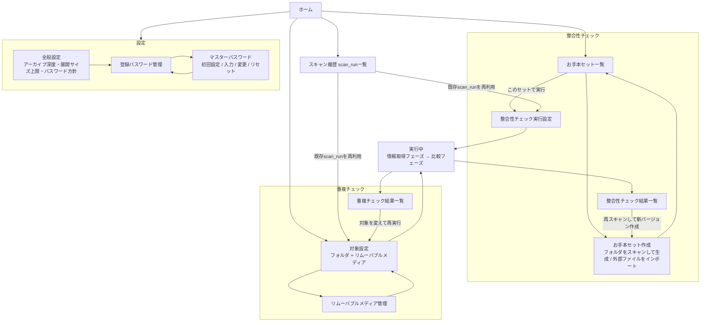

# File Checker 要件定義書

## 1. 概要・目的

File Checker は、大量のファイルを対象に以下の2つの課題を解決するためのツールである。

- **整合性チェック**: ファイルの破損・欠落を検出し、あらかじめ定義された「お手本セット」（正しいファイル名・サイズ・ハッシュ値の組み合わせ）をもとに、現状のファイル群からファイルセットを再構成・照合する。
- **重複チェック**: ユーザーが指定した複数のフォルダやリムーバブルドライブを横断して、重複するファイルを検出する。

写真・動画などのアーカイブや、大容量の外付けドライブ群を扱うユーザーが、データの破損・欠落や無駄な重複を効率的に把握できることをゴールとする。

## 2. 対象プラットフォーム

- **Windows**（Tier-1、優先的にサポート・検証を行う）
- **macOS**（Tier-2）
- **Linux**（Tier-2）

## 3. 機能要件

### 3.1 整合性チェック

- ファイルの破損検出: ハッシュ値を再計算し、以前記録した値との差分から変化（破損・改変）を検知する。
- お手本セットとの照合によるファイルセット再構成: 「お手本セット定義ファイル」（ファイル名・サイズ・ハッシュ値の組み合わせ一覧）をもとに、対象フォルダ内のファイルを走査し、期待されるセットが揃っているか（欠落・破損・不一致がないか）を再構成・検証する。

### 3.2 重複チェック

- ユーザーが設定した複数フォルダを横断して重複ファイルを検出する。
- リムーバブルドライブ（外付けHDD/USBメモリ等）も対象に含め、複数のリムーバブルメディアをまたいだ重複検出を行う。
- リムーバブルメディアは接続時にスキャンを行い、その結果を保存する。以降の重複比較では、都度メディアを接続し直さなくても、保存済みの過去チェック結果を活用できるようにする。

### 3.3 圧縮ファイル内部の走査

- 整合性チェック・重複チェックの対象には、通常ファイルに加えてzip・7z形式の圧縮ファイル内部のファイルも含める（対応形式・詳細は10.5参照）。
- 圧縮ファイルの読み取り（展開・ハッシュ照合）はチェック機能として必須とする。一方、圧縮ファイルの新規作成・書き換え（外部のお手本セットに合わせてファイル構成を変更する際の再構成作業）は読み取りとは別の機能として位置づける（詳細仕様は§10.19・§10.20で決定済み）。

### 3.4 お手本セット定義ファイル

- **自前形式**: JSON形式とする。マスタとなるフォルダをツールがスキャンし、ファイル名・サイズ・ハッシュ値のセット情報を自動生成する機能を提供する。
- **外部形式の読み込み**: 他ツールが生成した定義ファイル（CSV、XML等を想定）を読み込むアダプタ機構を用意する。形式ごとに個別の読み込み仕様（フィールドマッピング等）を定義する。

## 4. 非機能要件

- **想定処理規模**: 数十万〜百万ファイル、TBクラスのデータ量を扱えること。
- **処理速度**: 大量ファイルのハッシュ計算・走査を、実用的な時間で完了できる速度を最優先事項とする。並列I/O・並列ハッシュ計算を前提とした設計とする。
- **メモリ効率**: 上記規模のスキャンにおいても、メモリ使用量が実行環境の一般的なリソース制約内に収まること。

## 5. 技術スタック

- **言語・GUIフレームワーク**: Rust + Tauri を採用する。
  - 採用理由: 処理速度・メモリ効率を最優先とする非機能要件に対し、所有権システムによる安全な並列処理と高い実行効率を持つRustが適している。Tauriにより軽量なGUIバイナリを構築できる。
- **GUI/CLI共通コア**: 整合性チェック・重複チェックのコアロジックをRust crateとして実装し、GUI（Tauri）とCLIの双方から共通利用する構成とする。基本操作はGUIで提供し、一部機能はCLIからも操作可能にする。CLIが持つ機能はGUIの機能の部分集合に限定する（10.13参照）。

## 6. データ永続化

- スキャン結果（整合性チェック結果、重複チェック結果、リムーバブルメディアごとのチェック履歴）はローカルDB（SQLite）に保存する。
- リムーバブルメディアについては、メディアを識別した上で過去のスキャン結果とチェック履歴を紐付け、再接続時に再スキャンなしで比較に利用できるようにする。

## 7. UI/出力要件

- **GUI**: チェック結果（破損・欠落・重複ファイルなど）を一覧表示し、ソート・フィルタ操作を可能にする。
- **レポート出力**: チェック結果をCSV/JSON/HTML等のファイル形式でエクスポートできるようにする。
- **CLI**: チェック結果を標準出力に出力するとともに、成功・失敗・警告などの状態に応じた終了コードを返し、自動化・CI連携を可能にする。

## 8. 用語集

| 用語 | 定義 |
|---|---|
| お手本セット | 正しいファイル名・サイズ・ハッシュ値の組み合わせとして定義された、整合性チェックの基準となるファイル一覧。 |
| お手本セット定義ファイル | お手本セットの内容を記述したファイル。自前形式（JSON）または外部ツール互換形式（CSV/XML等）。 |
| 整合性チェック | お手本セット定義ファイルをもとに、対象フォルダのファイル群がセットとして揃っているか（欠落・破損なく一致するか）を検証する処理。 |
| 重複チェック | 複数のフォルダ・リムーバブルドライブを横断して、内容が同一のファイルを検出する処理。 |

## 9. 未決事項（Open Questions）

本要件定義書が最初に作成された時点で扱わなかった、後続の設計・実装セッションで詰めるべき論点として
以下の2点を挙げていた。**いずれも決定済み**（詳細は`docs/open-decisions.md`・10章参照）。

- ~~リムーバブルメディア識別のフォールバック方針（安定した識別子を取得できない／信頼できないメディアへの対応）~~
  → §10.21で決定
- ~~お手本セットに合わせた再構成（圧縮ファイル書き出し）機能の詳細仕様（トリガー、対象範囲等）~~
  → §10.19（生成フォーマット）・§10.20（トリガー・対象範囲・実行フロー）で決定

当初リストにはなかったが、決定事項の検討過程で新たに見つかった論点が4点あった（詳細・追跡は
`docs/open-decisions.md`参照）。スキャン履歴の保持・エラーログの保持は決定済み。非Solid版・ZSTD版7z
対応と再構成先の同名ファイル上書き方針の2点のみ、現時点でも未決のまま残っている:

- ~~スキャン履歴（`scan_run`/`check_run`等）の自動保持期間・自動プルーニング方針（§10.12で言及）~~
  → §10.22・§10.23で決定
- ~~エラーハンドリングのテキストログファイルのローテーション・保持期間（§10.17で言及）~~
  → §10.22で決定
- 非Solid版・ZSTD版7z（`NLZMA`/`SZSTD`/`NZSTD`）への対応要否（§10.19で言及、`docs/open-decisions.md` 7.3）
- 再構成先フォルダに参照ファイルと同名だが内容が異なるファイルが既存する場合の上書き/退避方針
  （§10.20で言及、`docs/open-decisions.md` 7.4）

## 10. 決定事項（Decisions）

### 10.1 ハッシュアルゴリズム（2026-08-30 決定）

- **外部お手本セット定義ファイル（CSV/XML等）の読み込み**: CRC32・MD5・SHA-1・SHA-256の4種を読み取り・照合可能なアルゴリズムとして実装する。外部ツールが生成したファイルに記載されたハッシュ値をそのまま照合に用いる必要があり、File Checker側でアルゴリズムを選べないための必須要件。
- **自前形式（JSON）でのお手本セット生成、および重複チェックの最終確定ハッシュ**: SHA-256を標準アルゴリズムとする。
  - 理由: 上記4種はいずれにせよ実装するため、追加コストなしで最も安全なものを既定にできる。SHA-NI等のハードウェア支援により、現行CPUではMD5との実効速度差も小さい。
- **重複チェックの一次フィルタ**: サイズ一致 → CRC32による粗い絞り込み → SHA-256による最終確定、の2段階方式とする。CRC32は外部互換のためどのみち実装するので、追加コストなく再利用する。

### 10.2 重複判定アルゴリズムの方式（2026-08-30 決定）

- 部分ハッシュ（ファイル先頭のみ等）は導入せず、**サイズ一致 → CRC32(全体)による絞り込み → SHA-256(全体)による最終確定**のシンプルな2段階方式とする（10.1の一次フィルタ方針をそのまま採用）。
- 部分ハッシュ導入案（先頭N KB/MBを読んだ時点で非重複を早期棄却しI/Oを削減する案）も比較検討したが、採用しない。パーシャルハッシュ段を挟むとCRC32(全体)と役割が重複し段数が増える割に効果が薄いこと、および実装のシンプルさを優先。TB級データでのI/O負荷が実運用上問題になった場合は再検討する。

### 10.3 処理フェーズの分離方針（2026-08-30 決定）

- 処理は「情報取得フェーズ」と「比較フェーズ」を明確に分離した2段階構成とする。対象ファイル群（フォルダ・リムーバブルメディア）の走査・情報収集をすべて完了させてから、比較処理（整合性チェックのお手本セット照合、重複チェックのグルーピング・ハッシュ比較）に着手する。
- 走査と並行して逐次比較を行う「中途比較」（ストリーミング／インクリメンタル方式）は今回は採用せず、将来の検討課題とする。
- ハッシュ計算の段階分け（重複チェックのサイズ→CRC32→SHA-256、10.2）は、この「比較フェーズ」の内部処理として引き続き適用する。情報取得フェーズではパス・サイズ等のメタデータ収集にとどめ、ハッシュ計算は比較フェーズ側で行う。整合性チェックはお手本セットとの照合上、対象ファイル全件のハッシュ計算が必要になる。

### 10.4 リムーバブルメディアの識別方法（2026-08-30 決定）

- リムーバブルメディアの識別ロジックは、OS（Windows/macOS/Linux）ごとに取得できる識別子の性質が異なることを前提に、**ターゲットOSごとに切り替え可能な実装（プラットフォーム抽象化）**とする。GUI/CLI共通コアの中で、識別ロジックをOS別実装に差し替え可能な形（trait等）で持つ。
- SQLiteスキーマ（2.1で詳細設計）上は、OS固有のフィールドをそのまま持たず、`identifier_type`（例: デバイス側シリアル／ファイルシステムUUID等の種別）＋`identifier_value`＋`platform`のように抽象化した形で保持する。これにより、対応OSを追加してもスキーマ変更が不要になる。
- 各OSにおいて、どの識別子（デバイス側シリアル、ファイルシステムUUID等）をどのような優先順で取得・採用するかという具体的な実装方針は、各OS実装時に定める。本決定はスキーマ・アーキテクチャレベルの抽象化方針を確定するものであり、OSごとの具体的な取得ロジックまでは範囲としない。
- 上記いずれの識別子も取得できない、または信頼できない（再接続時に安定して一致しない）メディアに対する
  フォールバック方針は§10.21で決定済み（自動取得失敗時はユーザーに明示表示の上、自由記述のラベル入力を
  識別子として採用する）。

### 10.5 対応する圧縮ファイル形式（2026-08-30 決定）

- 圧縮ファイル内部のファイルをチェック対象に含める場合の対応形式は **zip** および **7z** とする。
- 各形式それぞれの標準的な圧縮方式に加え、**zstd圧縮を用いたzip/7z**にも対応する（読み取り時にzstdデコードに対応したライブラリ・実装を用いる）。
- 圧縮ファイルの読み取り（展開・ハッシュ照合）は整合性チェック・重複チェック双方で必須の機能とする。圧縮ファイルの新規作成・再構成（外部のお手本セットに合わせてファイル構成を変更する際に圧縮ファイルとして書き出す作業）は、読み取りとは別の機能として扱う。
- 上記の再構成作業で圧縮ファイルを生成する場合は、**TorrentZip**（zip向け）・**Torrent7z**（7z向け）に準拠したファイル構造で出力する。これにより同一内容から生成した圧縮ファイルがツール非依存でバイト一致（決定的）になり、再現性のあるハッシュ照合が可能になる。
  - **追記（2026-09-04決定、詳細: §10.19）**: 7z側の「Torrent7z」は、元祖`torrent7z_0.9beta`形式ではなく、RomVaultが現行実装で標準採用している後継形式**RV7Z（RomVault7Zip）**に倣うものとする。
- 対応形式は今後拡張されうるため、**DBスキーマ上は対応形式をCHECK制約等で固定しない**。`scanned_file`テーブルの`archive_format`列は自由文字列として保持し、対応形式の判定・検証はアプリケーション層（読み取りアダプタの実装有無）で行う。これにより、将来zip/7z以外の形式に対応を広げる際もスキーマ変更が不要になる。
- **お手本セットに合わせた再構成（圧縮ファイル書き出し）機能の詳細仕様**（トリガー条件・対象範囲・
  CLI/GUIの起動導線）は、生成フォーマット（§10.19）に続き§10.20で決定済み。

### 10.6 圧縮ファイル展開時の安全対策（2026-08-30 決定）

- **再帰展開の深さ制限**: 圧縮ファイル内に圧縮ファイルが含まれる場合、展開は最大3階層までとする。4階層目以降に見つかった圧縮ファイルは、それ以上展開せず通常ファイル（1つのファイルとしてハッシュ計算のみ行う対象）として扱う。
- **展開サイズの検査**: エントリをメモリ上に展開する際、アーカイブ構造（セントラルディレクトリ等）に記載された「圧縮前（展開後）サイズ」を事前に取得し、実際の展開結果がこの宣言サイズを超えないことを検査する。宣言サイズを超えて展開されるケースは、改ざん・破損したアーカイブとみなしエラー扱いとする（5.1のエラーハンドリング方針に従う）。
- **展開後サイズの上限**: エントリ1件あたりの展開後サイズ上限は、現時点では2TBとする。
- **将来の拡張性**: 深さ制限（3階層）・サイズ上限（2TB）はいずれも値をハードコードせず、設定値として保持し、将来変更可能な設計とする。

### 10.7 暗号化・パスワード保護された圧縮ファイルの扱い（2026-08-30 決定）

- アプリ設定で、ユーザーが以下いずれかの動作を選択できるようにする:
  1. **エラーとする**: パスワード保護されたアーカイブ（エントリ）を検出した場合、復号を試みずエラー扱いとする（5.1のエラーハンドリング方針に従う）。
  2. **登録済みパスワードで復号を試行する**: ユーザーが事前に登録したパスワードを用いて復号を試みる。パスワードは圧縮ファイル形式ごとの個別設定、および複数形式への一括設定の両方に対応する（登録UI・保存方式は10.9参照）。
- モード2で、登録済みのいずれのパスワードでも復号できなかった場合（該当パスワードなし、パスワード誤り等）も、エラー扱いとする。
- **圧縮ファイル書き出し（再構成）機能自体の詳細仕様**（トリガー、対象範囲等）は§10.20で決定済み。

### 10.8 ハッシュ計算のI/O設計（2026-09-01 決定）

- **通常フォルダ**: 10.2の段階的フィルタ（サイズ→CRC32(全体)→SHA-256(全体)）を維持する。CRC32で絞り込んだ候補のみ後続でSHA-256を計算する、パスを分けた設計のままとする（多くのファイルはCRC32までしか計算されない）。
- **複数ハッシュアルゴリズムの同時計算**: 同一の読み込みパス内で複数アルゴリズムの値が同時に必要になる場面（例: 外部お手本セット定義ファイルとの照合でCRC32・MD5・SHA-1・SHA-256のうち複数種類を算出する場合、自前JSON形式のお手本セット生成時に複数アルゴリズムを一度に記録する場合）では、ファイルを複数回読み直すのではなく、読み込んだ同じチャンクを必要な複数のハッシュオブジェクトに並行してupdateし、同一ファイルへのI/Oの重複読み込みを避ける設計とする。
- **リムーバブルメディアは例外として、常に上記の同時計算方式を適用する**: リムーバブルメディアはスキャン後に取り外される可能性があり、CRC32計算後にメディアが未接続になっていると、SHA-256計算のために再度読み込む後続パスを実行できない（10.2の段階的フィルタが前提とする「後から候補だけ追加で読み直す」運用が成立しない）。そのため、リムーバブルメディアをスキャンする際は、段階的フィルタによるSHA-256計算の遅延を行わず、メディアが接続されている単一の読み込みパス中にCRC32・SHA-256（必要に応じてMD5・SHA-1も）をすべて同時に計算し、結果をDBに保存する。これにより、CRC32一致後の絞り込み比較（重複判定等）はメディア切断後でも保存済みのSHA-256値を使って行える。
  - この例外は10.3（情報取得フェーズ／比較フェーズの分離）にも影響する: 通常フォルダでは「情報取得フェーズはメタデータ収集にとどめ、ハッシュ計算は比較フェーズで行う」が、リムーバブルメディアについては接続中に必要なハッシュ計算まで完了させる必要があるため、情報取得フェーズの時点でCRC32・SHA-256の計算まで済ませる（比較フェーズはメディア切断後でも保存済みの値を使って実行できる）。

### 10.9 登録パスワードの保存方式・管理画面（2026-09-01 決定）

- **保存先**: 登録パスワードは、スキャン結果等を格納するSQLite DBには含めない。DBとは別に、アプリの設定フォルダ内に置く専用の設定ファイルに保存する。
- **管理方式**: OSの資格情報マネージャ／キーチェーン連携等の高度な仕組みは用いず、アプリ内で完結する簡易な管理とする。10.7で定めた「圧縮ファイル形式ごとの個別設定・複数形式への一括設定」は、いずれもこの設定ファイル内で表現する。
- **GUI**: パスワードの確認・追加・削除を行うための専用の管理画面をGUIに設ける。
- 設定ファイルの具体的な保護方式はマスターパスワード方式とする（10.10参照）。

### 10.10 登録パスワード設定ファイルの保護方式（2026-09-01 決定）

- **背景**: File Checkerはソースコードを公表する前提のため、アプリのコードに埋め込んだ鍵やOSユーザーアカウントに紐づくだけの暗号化では、同じファイル・同じ実行環境にアクセスできる者に対して実質的な保護にならない。アプリ機能のみで有効な保護を行うには、コードにもファイルにも残らない秘密（ユーザーが記憶する秘密）を鍵の導出に用いる必要がある。
- **方式**: ユーザーが設定する**マスターパスワード**から、鍵導出関数（KDF）を用いて登録パスワード設定ファイルの暗号化鍵を導出する。マスターパスワード自体はどこにも保存しない。KDFはArgon2idを既定候補とする（メモリ困難性が高くGPU/ASICによる総当たりに強いため）。具体的なコスト・パラメータ調整は実装時に行う。
- **マスターパスワードの設定・利用**:
  - 初回、登録パスワード機能を使う際にマスターパスワードの設定を求める。
  - 以降、登録パスワードの追加・削除・アーカイブ復号時の利用など、設定ファイルを復号する必要がある操作の際にマスターパスワードの入力を求める。入力されたマスターパスワードから導出した鍵はメモリ上でのみ保持し、設定ファイルには保存しない（セッションを跨いで平文・鍵を保持しない）。
  - マスターパスワードが正しいかどうかの検証には、マスターパスワード自体やそこから導出した鍵をそのまま保存するのではなく、検証用の値（ソルト付きハッシュ等）を別途設定ファイル内に保持する。
  - マスターパスワードの変更機能を設ける（現在のマスターパスワードで一度復号し、新しいマスターパスワードから導出した鍵で再暗号化する）。
- **マスターパスードを忘れた場合**: 復元手段は提供しない（設計上の意図: 復元可能にすると保護が無意味になる）。忘れた場合は、登録済みパスワードを含む設定ファイルをリセット（破棄）し、マスターパスワードを再設定した上で、登録パスワードを再登録してもらう「リセット」操作をGUIに用意する。この操作によるデータ喪失はユーザーに明示的に警告する。
- **GUI**: 10.9で定めたパスワード管理画面に加えて、マスターパスワードの初回設定・入力・変更・リセットのための画面を設ける。

### 10.11 比較結果ステータスの定義（エラーと不一致の区別）（2026-09-02 決定）

- **背景**: 「ファイルにアクセスできない／圧縮ファイルが正常に展開できない」といった検証不能な状態と、「正しく読み取れた上でお手本セットの値と一致しなかった」という確定的な不一致・破損の状態は、原因も対応もまったく異なる。両者を区別せず記録すると、実際には壊れていないファイル（一時的なアクセス権限問題等）を「破損」と誤認する／逆に本当の破損をエラーの陰に隠してしまうおそれがある。
- **整合性チェックの結果ステータスは、以下の5種類を明確に区別する**:
  - **一致（ok）**: ファイルを正常に読み取り、お手本セットの値と一致した。
  - **不一致・破損（corrupted）**: ファイルを正常に読み取れた（ハッシュ計算が完了した）上で、お手本セットの値と一致しなかった。読み取りには成功しているという意味で確定的な判定。
  - **欠落（missing）**: お手本セットに存在するファイルが、走査対象に一件も見つからなかった。
  - **余剰（extra）**: 走査対象に存在するが、お手本セットには存在しないファイル。
  - **エラー・検証不能（error）**: アクセス不可、I/Oエラー、圧縮ファイルの展開失敗、パスワード復号失敗等により、読み取り・ハッシュ計算自体が完了せず、一致/不一致を判定できなかった状態。「不一致・破損」とは別カテゴリとして扱い、両者を混同しない。
- **重複チェックにも同様の区別を適用する**: ハッシュ計算がエラーで完了しなかったファイルは、重複グルーピングの対象からは除外しつつ、結果には「エラー」として明示的に記録する（黙って無視しない）。
- **DBスキーマへの反映**: `scanned_file.status`（`ok`/`error`/`skipped`）と`integrity_check_result.result_status`を連動させ、`scanned_file.status = 'error'`のファイルは`integrity_check_result.result_status = 'error'`として記録する（`corrupted`とは区別する）。ドラフト中の`docs/DBスキーマ案.md`の`result_status`列挙値に`error`を追加する。
- **GUI/CLI/レポート出力**: 「エラー（検証不能）」と「不一致（破損確定）」は、一覧表示・件数集計・エクスポートのいずれにおいても別カテゴリとして扱う。個別のエラー原因（アクセス不可／展開失敗／パスワード不一致等）は5.1のエラーハンドリング方針に従って記録する。

### 10.12 SQLiteスキーマ設計（2026-09-02 決定）

`docs/DBスキーマ案.md`（レビュー用ドラフト）をベースに、以下の4点を確定した上で最終スキーマとする。

- **情報取得（`scan_run`）と比較実行（`check_run`）を分離する**: ドラフトの`scan_session`は「1回の情報取得」
  と「比較結果の入れ物」を1テーブルに同居させていたが、これを分離する。`scan_run`は対象が1つのフォルダまたは
  1つのリムーバブルメディアのいずれか一方（追記型、何度でも新規作成可）、`check_run`は比較実行（整合性 or
  重複）で、`check_run_source`中間テーブル経由で複数の`scan_run`（新規スキャン分・過去の保存済みスキャン分の
  混在も可）を束ねられる。これにより「リムーバブルメディアを再接続せず過去スキャンを重複比較に再利用する」
  （§6）が、`check_run_source`で明示的に表現できる。
  - **フォルダの経年変化検知への適用**: §3.1の「以前記録した値との差分から変化（破損・改変）を検知する」は、
    §3.4の「マスタフォルダをスキャンして基準セットを自動生成する」機能を、ユーザーが選んだ任意のフォルダ・
    任意のタイミングに繰り返し適用することで実現する。時点T1の`scan_run`から`reference_set`を自動生成
    （`reference_set.generated_from_scan_run_id`に由来を記録）し、時点T2に同じフォルダを再`scan_run`した上で、
    それを`reference_set_id`にT1由来のセットを指定した`check_run`（`check_type='integrity'`）で比較すれば、
    ハッシュが変わったファイルは`corrupted`、消えたファイルは`missing`、増えたファイルは`extra`として検知
    される。ツールは「意図的な編集」と「破損」を意味的に区別できないため（両者とも§3.1で「破損・改変」と
    まとめて扱われている）、差分の事実のみを記録し解釈はユーザーに委ねる。この専用の比較モードのために
    `check_run`や`integrity_check_result`に追加のカラム・分岐は不要で、既存の`reference_set`の仕組みを
    そのまま再利用する。
- **`integrity_check_result.result_status`に`extra`を追加する**（10.11の5ステータスに準拠。`error`も含む）。
  お手本セットに存在しないファイルは`reference_file_id IS NULL AND scanned_file_id`が設定された行として記録
  する。
- **ハッシュ値・CRC32の格納型**: `crc32`は`INTEGER`、`md5`/`sha1`/`sha256`は`BLOB`とする（ドラフトの全列TEXT
  案から変更）。数十万〜百万ファイル規模（§4）でのストレージ・インデックスサイズを抑えるため。CSV/JSON/HTML
  エクスポートやCLI標準出力時は16進文字列へのエンコードをアプリ層で行う。
- **お手本セットのバージョン管理**: `reference_set`に`supersedes_reference_set_id`（自己参照、
  `UNIQUE`制約により分岐なしの線形履歴）を追加する。同名セットの再生成を「新バージョン」として明示的に
  連鎖できる。

以下が最終スキーマである（SQLite 3.45.1の`:memory:`DBに対し構文エラーなく11テーブルを作成できることを
確認済み。`STRICT`テーブルはSQLite 3.37以降が必要）:

```sql
PRAGMA foreign_keys = ON;

-- 1. 横断設定
CREATE TABLE app_setting (
    key   TEXT PRIMARY KEY,
    value TEXT NOT NULL
) STRICT;
-- 例: ('archive_max_depth','3'), ('archive_entry_size_limit_bytes','2199023255552')  -- §10.6

-- 2. リムーバブルメディア識別（§10.4）
CREATE TABLE removable_media (
    id                INTEGER PRIMARY KEY,
    platform          TEXT NOT NULL CHECK (platform IN ('windows','macos','linux')),
    identifier_type   TEXT NOT NULL,   -- 自由文字列（例: 'device_serial','filesystem_uuid'）。CHECK制約なし
    identifier_value  TEXT NOT NULL,
    display_name      TEXT,            -- ボリュームラベル等、GUI表示専用
    first_seen_at     INTEGER NOT NULL, -- unixミリ秒
    last_seen_at      INTEGER NOT NULL,
    UNIQUE (platform, identifier_type, identifier_value)
) STRICT;

-- 3. 情報取得フェーズ（§10.3/§10.8）
CREATE TABLE scan_run (
    id                 INTEGER PRIMARY KEY,
    target_type        TEXT NOT NULL CHECK (target_type IN ('folder','removable_media')),
    folder_path        TEXT,
    removable_media_id INTEGER REFERENCES removable_media(id) ON DELETE RESTRICT,
    hash_mode          TEXT NOT NULL DEFAULT 'lazy' CHECK (hash_mode IN ('lazy','eager')),
                        -- 'lazy'=通常フォルダ（比較フェーズで段階的にハッシュ計算, §10.3）
                        -- 'eager'=リムーバブルメディア（接続中の単一パスで全ハッシュ計算, §10.8）
    status             TEXT NOT NULL DEFAULT 'running' CHECK (status IN ('running','completed','failed','cancelled')),
    started_at         INTEGER NOT NULL,
    completed_at       INTEGER,
    error_message      TEXT,
    CHECK (
        (target_type = 'folder'          AND folder_path IS NOT NULL AND removable_media_id IS NULL)
        OR
        (target_type = 'removable_media' AND removable_media_id IS NOT NULL AND folder_path IS NULL)
    )
) STRICT;

CREATE INDEX idx_scan_run_media  ON scan_run(removable_media_id, status, completed_at DESC);
CREATE INDEX idx_scan_run_folder ON scan_run(folder_path, status, completed_at DESC);
-- ^ 「このフォルダ／このメディアの直近完了スキャンはどれか」の検索を支える

-- 4. 走査結果（通常ファイル・アーカイブ内エントリ, §3.3/§10.5/§10.6）
CREATE TABLE scanned_file (
    id                     INTEGER PRIMARY KEY,
    scan_run_id            INTEGER NOT NULL REFERENCES scan_run(id) ON DELETE CASCADE,
    path                   TEXT NOT NULL,     -- scan_runのルートからの相対パス
    parent_archive_file_id INTEGER REFERENCES scanned_file(id) ON DELETE CASCADE,
                                               -- NULL=通常ファイル、非NULL=アーカイブ内エントリ
    archive_format         TEXT,              -- 例: 'zip','7z'。自由文字列、CHECK制約なし（§10.5の明示要件）
    archive_depth          INTEGER NOT NULL DEFAULT 0 CHECK (archive_depth >= 0),
                                               -- 0=通常ファイル、1〜=ネスト段数。上限(既定3)はapp_settingで
                                               -- 管理し、アプリ層で強制する（§10.6: ハードコード禁止）
    size                   INTEGER NOT NULL CHECK (size >= 0),
    mtime                  INTEGER,
    crc32                  INTEGER,
    md5                    BLOB,
    sha1                   BLOB,
    sha256                 BLOB,
    status                 TEXT NOT NULL DEFAULT 'ok' CHECK (status IN ('ok','error','skipped')),
    error_message          TEXT,
    scanned_at             INTEGER NOT NULL
) STRICT;

CREATE INDEX idx_scanned_file_run        ON scanned_file(scan_run_id);
CREATE INDEX idx_scanned_file_run_path   ON scanned_file(scan_run_id, path);
CREATE INDEX idx_scanned_file_size_crc32 ON scanned_file(size, crc32);
CREATE INDEX idx_scanned_file_sha256     ON scanned_file(sha256);
CREATE INDEX idx_scanned_file_parent     ON scanned_file(parent_archive_file_id);

-- 5. お手本セット（§3.4/§8）
CREATE TABLE reference_set (
    id                          INTEGER PRIMARY KEY,
    name                        TEXT NOT NULL,
    source_format               TEXT NOT NULL,  -- 'json'/'csv'/'xml'等、自由文字列
    source_path                 TEXT,            -- 元ファイルパス（provenance用、nullable）
    generated_from_scan_run_id  INTEGER REFERENCES scan_run(id) ON DELETE SET NULL,
                                                  -- ある scan_run から自動生成した場合の由来
    supersedes_reference_set_id INTEGER REFERENCES reference_set(id) ON DELETE SET NULL,
                                                  -- 旧バージョンを指す自己参照（線形履歴）
    created_at                  INTEGER NOT NULL,
    UNIQUE (supersedes_reference_set_id)
) STRICT;

CREATE INDEX idx_reference_set_name ON reference_set(name, created_at DESC);

CREATE TABLE reference_file (
    id               INTEGER PRIMARY KEY,
    reference_set_id INTEGER NOT NULL REFERENCES reference_set(id) ON DELETE CASCADE,
    path             TEXT NOT NULL,
    size             INTEGER NOT NULL CHECK (size >= 0),
    crc32            INTEGER,
    md5              BLOB,
    sha1             BLOB,
    sha256           BLOB,
    UNIQUE (reference_set_id, path)
) STRICT;

CREATE INDEX idx_reference_file_set_size ON reference_file(reference_set_id, size);
CREATE INDEX idx_reference_file_sha256   ON reference_file(sha256);

-- 6. 比較実行（§10.3）— 複数の scan_run を束ねられる
CREATE TABLE check_run (
    id                INTEGER PRIMARY KEY,
    check_type        TEXT NOT NULL CHECK (check_type IN ('integrity','duplicate')),
    reference_set_id  INTEGER REFERENCES reference_set(id) ON DELETE RESTRICT,
    status            TEXT NOT NULL DEFAULT 'running' CHECK (status IN ('running','completed','failed','cancelled')),
    started_at        INTEGER NOT NULL,
    completed_at      INTEGER,
    error_message     TEXT,
    CHECK (
        (check_type = 'integrity' AND reference_set_id IS NOT NULL)
        OR
        (check_type = 'duplicate' AND reference_set_id IS NULL)
    )
) STRICT;

CREATE TABLE check_run_source (
    id           INTEGER PRIMARY KEY,
    check_run_id INTEGER NOT NULL REFERENCES check_run(id) ON DELETE CASCADE,
    scan_run_id  INTEGER NOT NULL REFERENCES scan_run(id) ON DELETE RESTRICT,
    UNIQUE (check_run_id, scan_run_id)
) STRICT;
-- scan_run_id は RESTRICT: 1つのcheck_runを消しても、他のcheck_runが再利用しているかもしれない
-- 生データ(scan_run)は道連れで消さない

CREATE INDEX idx_check_run_source_check ON check_run_source(check_run_id);
CREATE INDEX idx_check_run_source_scan  ON check_run_source(scan_run_id);

-- 7. 整合性チェック結果（§3.1/§10.11）
CREATE TABLE integrity_check_result (
    id                INTEGER PRIMARY KEY,
    check_run_id      INTEGER NOT NULL REFERENCES check_run(id) ON DELETE CASCADE,
    reference_file_id INTEGER REFERENCES reference_file(id) ON DELETE CASCADE,
    scanned_file_id   INTEGER REFERENCES scanned_file(id) ON DELETE CASCADE,
    result_status     TEXT NOT NULL CHECK (result_status IN ('ok','corrupted','missing','extra','error')),
    detail            TEXT,
    CHECK (reference_file_id IS NOT NULL OR scanned_file_id IS NOT NULL)
    -- missing => reference_file_idのみ / extra => scanned_file_idのみ / それ以外は両方セット
) STRICT;

CREATE INDEX idx_integrity_result_run     ON integrity_check_result(check_run_id);
CREATE INDEX idx_integrity_result_ref     ON integrity_check_result(reference_file_id);
CREATE INDEX idx_integrity_result_scanned ON integrity_check_result(scanned_file_id);
CREATE INDEX idx_integrity_result_status  ON integrity_check_result(check_run_id, result_status);

-- 8. 重複チェック結果（§3.2）
CREATE TABLE duplicate_group (
    id           INTEGER PRIMARY KEY,
    check_run_id INTEGER NOT NULL REFERENCES check_run(id) ON DELETE CASCADE,
    sha256       BLOB NOT NULL,
    size         INTEGER NOT NULL,
    member_count INTEGER NOT NULL DEFAULT 0,
    UNIQUE (check_run_id, sha256)
) STRICT;

CREATE INDEX idx_duplicate_group_run ON duplicate_group(check_run_id);

CREATE TABLE duplicate_group_member (
    id                  INTEGER PRIMARY KEY,
    duplicate_group_id  INTEGER NOT NULL REFERENCES duplicate_group(id) ON DELETE CASCADE,
    scanned_file_id     INTEGER NOT NULL REFERENCES scanned_file(id) ON DELETE CASCADE,
    UNIQUE (duplicate_group_id, scanned_file_id)
) STRICT;

CREATE INDEX idx_dup_member_group ON duplicate_group_member(duplicate_group_id);
CREATE INDEX idx_dup_member_file  ON duplicate_group_member(scanned_file_id);
```

- **ハッシュを正規化テーブルにせず列で持つ方針（ドラフトの結論を踏襲）**: 重複チェックの主要クエリが
  `GROUP BY size`→`GROUP BY size, crc32`→`sha256`一致という、単一の広い行へのインデックス範囲スキャンで
  完結する形であり、正規化するとファイルごとに複数行のJOINが必要になり数十万〜百万ファイル規模（§4）で
  不利になる。アルゴリズムは最大4種（crc32/md5/sha1/sha256）と有限個数が分かっているため、EAV的正規化の
  メリット（動的な属性追加）も薄い。
- **アーカイブネストを別テーブルにせず自己参照で表現する方針（ドラフトの結論を踏襲）**: 通常ファイルも
  アーカイブ内エントリも「整合性・重複チェックの対象」という点で本質的に同種のレコードであり、ハッシュ計算・
  重複グルーピング・整合性照合のロジックを両者で共通化できる。
- **今回のスキーマ設計では対応しない点**: リムーバブルメディア識別のフォールバック方針は§10.21で
  決定済み（スキーマ変更不要、`identifier_type`の新値`user_defined`で表現）。スキャン履歴の自動保持
  期間・自動プルーニング方針は、`docs/open-decisions.md`に未決事項として追跡中（本節時点では未着手）。
  いずれも`removable_media`／`scan_run`の追加カラムで将来拡張できる設計としてある。

### 10.13 CLIの機能スコープ方針（2026-09-02 決定）

- **CLIはGUIの機能の部分集合とする**: CLIは、GUIに存在する機能を呼び出すための薄いインターフェースと
  して位置づけ、CLI固有の新規機能・振る舞いは追加しない。整合性チェック・重複チェックのコアロジックは
  §5の決定通りRust crateとしてGUI/CLI間で共有されているが、この方針はさらに「CLIという実行形態その
  ものに、GUIには存在しない機能を持たせない」ことを明確化するものである。
- **理由**: GUIとCLIで機能セットが分岐すると、(a) どちらか一方でしか検証・利用できない機能が生まれ
  メンテナンスコストが増える、(b) ユーザーが「CLIでできることは必ずGUIでもできる」という前提を持てず、
  GUI利用者向け・CLI利用者向けのドキュメントを別々に整備する必要が生じる。CLIをGUIの部分集合に限定
  することで、機能のドキュメント化・テストの基準をGUI側に一本化できる。
- **4.1（CLIのサブコマンド体系・オプション設計）への適用**: 今後4.1を検討する際は、「このサブコマンド
  /オプションはGUIのどの機能に対応するか」を先に確認し、対応するGUI機能が存在しないコマンドは追加
  しない（必要であれば、先にGUI側の機能として定義してからCLI化する）。
- **例外として認める範囲**: GUIには存在し得ない、CLIという実行環境固有の関心事（§7で定めた終了コード
  仕様、標準出力のフォーマット等、自動化・CI連携のための表現形式）は、この「機能の部分集合」制約の
  対象外とする。これらは新規の「機能」ではなく、既存の機能結果をCLIという実行環境に適した形で出力
  するための表現方式の違いとして扱う。

### 10.14 GUIのワイヤーフレーム・画面遷移（2026-09-03 決定）

`docs/DBスキーマ案.md`／10.12の最終スキーマが表すデータ（`scan_run`・`reference_set`・`check_run`・
各結果テーブル）を、どの画面がどう作成・参照するかという単位で画面を切り出した。10.13により
CLIはGUIの機能の部分集合となるため、本節の画面構成が4.1（CLIサブコマンド設計）の対応表の基準にもなる。

#### 画面遷移図



- 「実行中」画面（情報取得フェーズ→比較フェーズ、§10.3）は整合性・重複チェックの共通コンポーネントとし、
  画面自体は1つに統一する。
- 「スキャン履歴」は`scan_run`を横断的に一覧する画面で、フォルダ・リムーバブルメディアいずれの過去
  スキャンも、整合性チェック実行設定・重複チェック対象設定の双方から「新規スキャンの代わりに既存
  scan_runを使う」形で再利用できる（§6、`check_run_source`）。

#### 画面一覧と主要構成要素

**ホーム**
- 直近の`check_run`（整合性・重複いずれも）の一覧: 種別・実行日時・ステータス・結果件数サマリ。
- 「整合性チェックを開始」「重複チェックを開始」の2つの主要導線ボタン。
- お手本セット数・登録済みリムーバブルメディア数などの概況表示。

**お手本セット一覧**（整合性チェック）
- `reference_set`を名前でグループ化し、`supersedes_reference_set_id`のバージョン履歴を1系列として表示
  （最新版を先頭に、過去版は折りたたみ）。
- 各セットに「このセットでチェック実行」「再スキャンして新バージョン作成」ボタン。

**お手本セット作成**（新規 / バージョン更新 共通画面、タブ切り替え）
- タブ「フォルダをスキャンして生成」: 対象フォルダ選択 → スキャン実行（SHA-256固定、§10.1）→ セット名
  入力 → 保存。バージョン更新から開いた場合は名前を固定し`supersedes_reference_set_id`を自動設定。
- タブ「外部ファイルをインポート」: ファイル選択 → 形式（CSV/XML等）選択 → フィールドマッピング設定 →
  プレビュー → 取り込み。フィールドマッピングの詳細（除外ルール・merged/split選択等）はMAME向けに
  §10.18で決定済み。MAME以外の形式への拡張時は、同様の考え方で個別に具体化する。

**整合性チェック実行設定**
- お手本セット選択（お手本セット一覧から遷移時は選択済み）。
- 対象フォルダ選択（新規スキャン）または「スキャン履歴」からの既存`scan_run`選択。
- 圧縮ファイル関連の現在設定値（展開深度・展開後サイズ上限・パスワード方針）を表示し、変更は「設定」
  画面へリンク（本画面では変更しない）。
- 「実行」ボタン → 実行中画面へ。

**整合性チェック結果一覧**（例: 簡易ワイヤーフレーム）
```
┌ 整合性チェック結果 ─────────────────────────────────────┐
│ [OK: 12,340] [破損: 3] [欠落: 1] [余剰: 5] [エラー: 52]    │ ← ステータス別件数バッジ（クリックでフィルタ切替）
│ フィルタ: [OK][破損][欠落][余剰][エラー]  検索:[____]      │
├──────────────────────────────────────────────────────┤
│ パス                     │ サイズ │ ステータス │ 詳細       │
│ photos/a.jpg              │ 2.1MB  │ ok         │            │
│ 📦 photos/album.zip > b.jpg │ 1.8MB  │ corrupted  │ SHA256不一致│
│ photos/c.jpg              │ —      │ missing    │ 参照のみ存在 │
│ photos/x.tmp              │ 512KB  │ extra      │ 参照になし   │
│ ▶ 📦 broken.zip の展開に失敗（内部の期待ファイル 50件が検証不能）│ ← 折りたたみ行(§10.15)
│ photos/d.jpg              │ —      │ error      │ アクセス不可 │
├──────────────────────────────────────────────────────┤
│                                    [CSV][JSON][HTML]出力     │
└──────────────────────────────────────────────────────┘
```
- ステータス（ok/corrupted/missing/extra/error, §10.11）でのフィルタ、パス・サイズ・ステータスでの
  ソートを提供。エラーと破損は別バッジ・別カテゴリとして常に区別する（§10.11）。
- 行選択で詳細（お手本側・走査側それぞれのハッシュ値、エラーメッセージ等）を表示。
- **アーカイブ内エントリの表示**: パスは`親アーカイブ名 > 内部相対パス`の形式（`archive_depth`が示す
  ネスト段数ぶん`>`を重ねる）で表示し、📦アイコンなどで通常ファイルと視覚的に区別する。これにより、
  ネストしたファイルの非ok系ステータスも一覧内で他の行と同様にフィルタ・検索・ソートの対象になる。
- **アーカイブ展開失敗時のグルーピング表示（§10.15）**: 親アーカイブの展開自体に失敗した場合、その配下に
  期待される全エントリが`result_status='error'`として個別に記録される（§10.15）。件数が多いと同一原因の
  エラーが大量の行として並んでしまうため、一覧では`detail`（＝親アーカイブのエラーメッセージ）と
  `parent_archive_file_id`の系統が同じ行を1つの折りたたみ行（「〇〇.zipの展開に失敗（内部の期待ファイル
  N件が検証不能）」）に集約表示し、展開すると内部エントリの個別一覧が見られるようにする。ステータス別
  件数バッジの「エラー」件数には、集約前の内訳件数（=集約対象の行数）をそのまま表示する。集約せず全件を
  フラットな行で表示するモードもフィルタ欄の切り替えで提供する。

**重複チェック 対象設定**
- 対象フォルダの追加・削除（複数、リスト表示）。
- リムーバブルメディアの追加: 接続中メディア一覧から選択。未スキャンのメディアは「今すぐスキャン」、
  スキャン済みのメディアは「保存済みスキャン結果を使用」または「再スキャン」を選べる（§3.2/§6）。
- 「実行」ボタン → 実行中画面へ。

**リムーバブルメディア管理**（対象設定からのモーダル、独立画面としても遷移可）
- 既知メディア（`removable_media`）一覧: 表示名、識別子種別、最終確認日時、保存済みスキャン件数。
- メディアごとのスキャン履歴（`scan_run`一覧: 日時・ファイル数・ステータス）。
- 「今すぐスキャン」ボタン（該当メディアが接続中の場合のみ活性化）。

**重複チェック結果一覧**
- `duplicate_group`単位のグループ表示（サイズ・重複件数）。グループ展開でメンバーファイルのフルパスと
  所属`scan_run`（どのフォルダ／どのメディアの結果か）を表示。
- サイズ範囲・対象フォルダ／メディアでのフィルタ。
- CSV/JSON/HTML出力。
- ハッシュ計算がエラーで完了しなかったファイルは重複グルーピングから除外されるが、別セクションに
  「エラー」件数として明示する（§10.11）。

**スキャン履歴**
- 全`scan_run`（フォルダ・リムーバブルメディア双方）を横断した一覧: 対象種別、パス／メディア名、実行
  日時、ステータス、ファイル数。
- 各行から「この結果で整合性／重複チェックを実行」ボタンで実行設定画面へ遷移し、新規スキャンなしで
  再利用できる。

**設定 - 全般**
- 圧縮ファイル展開の深度上限（既定3, §10.6）・展開後サイズ上限（既定2TB, §10.6）の数値設定。
- パスワード保護アーカイブの扱い（§10.7）: 「エラーとする」／「登録済みパスワードで復号を試行する」の
  選択。後者を選んだ場合のみ「登録パスワード管理」への導線が活性化する。

**設定 - 登録パスワード管理**（§10.9）
- 形式別（zip/7z等）の登録パスワード一覧、複数形式への一括設定。
- 追加・確認・削除操作。いずれの操作もマスターパスワードの入力（未設定の場合は初回設定）を要求する。

**設定 - マスターパスワード関連モーダル群**（§10.10）
- 初回設定モーダル、入力モーダル（都度、鍵はメモリ上のみ保持）、変更モーダル（現在→新規）、リセット
  モーダル（登録パスワード設定ファイルの破棄を伴うことを明示した警告文言つき）。

**再構成実行**（§10.20で確定。整合性チェック結果一覧のツールバーに配置予定だった
「お手本セットに合わせて書き出す」ボタンから遷移）
- **充当計画画面**: 整合性チェック結果一覧（`missing`を含む状態）から「再構成」を選択すると遷移。
  再構成先フォルダの指定（新規スキャン or 既存`scan_run`の再利用）→充当計画の自動算出→
  参照ファイルごとの充当元（ローカル／どのリムーバブルメディアか）一覧、必要メディアのサマリ、
  未解決（`missing`のまま）件数を表示。「不足分を追加スキャン」ボタンで対象フォルダ／メディアを
  追加し再算出できる。「この計画で再構成を実行」ボタンで実行フェーズへ。
- **実行中（メディア入れ替え）画面**: `reconstruction_run`の進捗をメディア単位のチェックリストで表示。
  現在処理中のメディア、待機中のメディア一覧、書き込み済み／エラー件数をリアルタイム表示。
  エラー再試行後もなお失敗したファイルがある状態でメディア処理が完了すると、次のメディアの
  接続を促すダイアログを表示する。
- **完了報告画面**: 書き出し件数・サイズ、使用したメディアの内訳、未解決件数（`missing`および
  最終的にerrorのままだったもの）を表示し、CSV/JSON/HTML出力に対応（§10.14の既存出力機能を再利用）。

### 10.15 アーカイブ展開失敗時の欠落判定（2026-09-03 決定）

- **背景**: §10.11で「読み取り・ハッシュ計算自体が完了しなかった場合はerror（検証不能）として扱い、
  missing（欠落）とは明確に区別する」と決めているが、この区別をアーカイブのネスト構造（§3.3/§10.6）に
  適用する際の具体的な扱いは未規定だった。アーカイブファイル自体の展開に失敗した場合
  （`scanned_file.status='error'`）、その内部に存在するはずの個々のファイル（お手本セットが期待する
  エントリ）に対応する`scanned_file`行はそもそも作られない。これを素朴に扱うと、`integrity_check_result`
  側で該当する`reference_file`にヒットする`scanned_file`が存在しない＝`missing`（確定的に「存在しない」）
  として記録されてしまい、実際には「展開できず存在有無を確認できていない」というerror相当の状態を、
  確定的な欠落として誤って記録することになる。§10.12のスキーマ設計案をレビューする過程で発見された、
  実装時に迷いうる論点。
- **決定**: アーカイブ自体の展開に失敗した場合、そのアーカイブ配下に期待されるお手本セットのエントリ
  （`reference_file`）はすべて`integrity_check_result.result_status='error'`として記録する。`missing`には
  しない。この際`scanned_file_id`には、展開に失敗した親アーカイブ自身の`scanned_file`行
  （`status='error'`）を指す。`detail`には親アーカイブのエラー内容（`scanned_file.error_message`）を反映
  する。
- **判定方法**: アプリ層は、`reference_file.path`が展開失敗したアーカイブのパスをプレフィックスとして
  持つかどうかで対象を特定する（例: アーカイブが`broken.zip`、参照パスが`broken.zip/inner.jpg`）。最大
  3階層のネストが認められているため（§10.6）、この判定はネストしたアーカイブ（アーカイブの中のアーカイブ）
  が失敗した場合にも同様に再帰的に適用する。
- **DBスキーマへの影響**: スキーマ変更は不要（§10.12の`integrity_check_result`の既存の列構成でそのまま
  表現できる）。`:memory:`SQLiteで「正常に開けるアーカイブ」と「壊れて開けないアーカイブ」を含むシナリオを
  作成して検証し、前者の内部ファイルは`ok`、後者に対応するお手本セットのエントリは`error`として区別して
  記録・クエリできることを確認済み。

### 10.16 CLIのサブコマンド体系・オプション設計（2026-09-03 決定）

§10.13（CLIはGUIの機能の部分集合）に従い、§10.14で確定したGUI画面の各機能に対応する形でサブコマンドを
定義する。CLIに固有の関心事（終了コード・標準出力形式）のみ§10.13の例外として独自に定める。

#### サブコマンド体系

```
filechecker <グループ> <操作> [オプション]

# スキャン（情報取得フェーズ, §10.3）
scan folder <PATH> [--rescan]                     フォルダをスキャンしscan_runを作成
scan media (--media-id <ID> | --mount <PATH>)      接続中のリムーバブルメディアをスキャン（§10.8のeager方式）
scan list [--target-type folder|media] [--limit N] scan_run一覧（GUI「スキャン履歴」に対応）

# お手本セット（§3.4）
reference list                                     お手本セット一覧（supersedesのバージョン履歴含む）
reference generate --from-scan <SCAN_RUN_ID> --name <NAME> [--supersede <REF_SET_ID>]
                                                   既存scan_runからお手本セットを生成（§10.12の経年変化検知の起点）
reference import --file <FILE> --format <json|csv|xml> [--name <NAME>] [マッピング指定オプション]
reference delete <REF_SET_ID>

# リムーバブルメディア（§10.4/§6）
media list                                         既知メディア一覧（表示名・識別子種別・保存済みスキャン件数）

# 比較（比較フェーズ, §10.3）
check integrity --reference-set <REF_SET_ID> (--folder <PATH> | --scan-run <SCAN_RUN_ID>...)
check duplicate (--folder <PATH> | --scan-run <SCAN_RUN_ID> | --media-id <MEDIA_ID>)...
                                                   複数指定可。保存済みscan_runを混在させられる（check_run_source）
check list [--type integrity|duplicate] [--limit N] 過去のcheck_run一覧
check show <CHECK_RUN_ID>                          過去のcheck_run結果を再表示

# レポート出力（§7）
report export <CHECK_RUN_ID> --format csv|json|html --output <FILE>

# 再構成（§10.20）
reconstruct plan --check-run <CHECK_RUN_ID> --destination <PATH>
                                                   充当計画を算出（PATHが未スキャンならフォルダを
                                                   自動スキャンしてから算出）。結果は標準出力に
                                                   充当元一覧・必要メディア・未解決件数として出力
reconstruct run <RECONSTRUCTION_RUN_ID | --check-run <CHECK_RUN_ID> --destination <PATH>>
                                                   再構成を実行。メディア入れ替えが必要な場合は
                                                   標準入力で入れ替え完了の入力を待つ（§10.16の
                                                   マスターパスワードTTY待ちと同様の対話フロー）
reconstruct status <RECONSTRUCTION_RUN_ID>         実行状況・完了報告の再表示

# 設定（§10.6/§10.7）
config get [KEY]                                   app_settingの参照
config set <KEY> <VALUE>                           app_settingの変更
```

#### GUI機能との対応表（§10.13の部分集合であることの確認）

| GUI画面（§10.14） | 対応するCLIサブコマンド |
|---|---|
| ホーム（直近check_run一覧） | `check list` |
| お手本セット一覧 | `reference list` |
| お手本セット作成（フォルダから生成） | `reference generate` |
| お手本セット作成（外部ファイル取り込み） | `reference import` |
| 整合性チェック実行設定 | `check integrity` |
| 整合性チェック結果一覧 | `check integrity`の出力 / `check show` |
| 重複チェック 対象設定 | `check duplicate` |
| リムーバブルメディア管理 | `media list` / `scan media` |
| 重複チェック結果一覧 | `check duplicate`の出力 / `check show` |
| スキャン履歴 | `scan list` |
| 各結果一覧のCSV/JSON/HTML出力 | `report export` |
| 再構成実行（充当計画画面） | `reconstruct plan` |
| 再構成実行（実行中・完了報告画面） | `reconstruct run` / `reconstruct status` |
| 設定 - 全般 | `config get` / `config set` |
| 設定 - 登録パスワード管理・マスターパスワード | **CLIでは提供しない**（下記） |

#### CLIで提供しないもの（部分集合として意図的に除外）

- **登録パスワードの管理・マスターパスワード関連操作**（§10.9/§10.10）: マスターパスワードの入力・変更・
  リセットは対話操作が前提であり、CI等のTTYなし環境では成立しない。§10.13によりCLIはGUIの部分集合で
  あればよいため、これらの管理操作はGUI専用とする。

#### 実装上の前提・留意点

- **共通コアの利用**: 上記すべての操作は§5の共通コアcrateの呼び出しで実現でき、CLI固有の処理ロジックは
  持たない（§10.13）。CLI側の実装はコマンドライン引数のパース、コアへの委譲、結果の整形出力に限られる。
- **GUIとCLIによるDB同時アクセス**: 同一のSQLite DB（§10.12）をGUIプロセスとCLIプロセスが同時に開く
  可能性があるため、DB接続はWALモードを有効にし、`busy_timeout`を設定する。スキャン・比較の書き込みは
  トランザクションを細かく区切り、長時間の排他ロックを避ける。
- **パスワード保護アーカイブへの遭遇**（§10.7）: アプリ設定が「登録済みパスワードで復号を試行する」の
  場合、CLIでも設定ファイルの復号にマスターパスワードが必要になる。標準入力がTTYであればプロンプトを
  出して入力を求め、TTYでない場合（CI等）は復号を試行せず専用の終了コードで失敗する（下記の終了コード）。
  `--no-archive-password`オプションで、設定にかかわらず「パスワード保護アーカイブはエラー扱い」
  （§10.7のモード1相当）に切り替えて実行できる。
- **リムーバブルメディアのスキャン**: `scan media`はメディアが接続中の場合のみ実行できる。§10.8の決定に
  従い、接続中の単一パスでCRC32・SHA-256（必要に応じMD5・SHA-1）をまとめて計算する。

#### 実行結果の表示方法

§7の「標準出力への結果出力」「状態に応じた終了コード」を具体化する。表示内容そのものは§10.14のGUI結果
一覧と同じ情報（§10.11の5ステータス、§10.15/§10.14のアーカイブエラー集約）を扱い、CLIという実行環境に
合わせて表現形式のみを変える（§10.13の例外範囲）。

- **出力の分離**: 結果（機械処理の対象）は標準出力、進捗・警告・ログは標準エラー出力に分ける。これにより
  `filechecker check integrity ... | jq` のようなパイプ処理を、進捗表示を有効にしたまま実行できる。
- **出力形式**: `--format text|json|csv`（既定は`text`）。`text`は人間可読な要約＋明細、`json`/`csv`は
  §7のレポート出力と同じ構造を標準出力へ流す。`--output <FILE>`でファイルへ書き出す（HTMLは大きくなる
  ため`report export`側でのみ提供する）。
- **`text`形式の構成**（整合性チェックの例）:

```
$ filechecker check integrity --reference-set 3 --folder /data/photos
scanning /data/photos ... 12,351 files                      ← 標準エラー出力（進捗）
comparing against reference set "master" (v2) ...           ← 標準エラー出力（進捗）

整合性チェック結果 (check_run: 42, reference_set: 3 "master" v2)
  ok        12,340
  corrupted      3
  missing        1
  extra          5
  error         52

corrupted:
  photos/album.zip > b.jpg       1.8MB   SHA256不一致
  ...
missing:
  photos/c.jpg                      —    参照のみ存在
error:
  broken.zip の展開に失敗（内部の期待ファイル 50件が検証不能）   ← 既定では集約表示
  photos/d.jpg                      —    アクセス不可
```

- **アーカイブエラーの集約**: §10.15により、展開に失敗したアーカイブ配下の期待ファイルは1件ずつ`error`と
  して記録されるため、`text`形式では既定で§10.14のGUIと同様に1行へ集約表示する（「〇〇.zipの展開に失敗
  （内部の期待ファイル N件が検証不能）」）。`--expand-archive-errors`で全件をフラットに列挙できる
  （GUI側のフラット表示切り替えに対応）。`json`/`csv`形式は集約せず常に全件を出力する（機械処理側で
  集計できるため）。
- **件数集計**: ステータス別件数は常に集約前の実件数（＝`integrity_check_result`の行数）を表示する。
  重複チェックでは重複グループ数・重複ファイル総数・削減可能サイズ見込み、およびハッシュ計算エラーで
  グルーピング対象外となった件数（§10.11）を表示する。
- **明細の絞り込み**: `--status ok,corrupted,missing,extra,error`（複数指定可）で出力する明細を絞り込む
  （GUI結果一覧のフィルタに対応）。既定では`ok`の明細は出力せず件数のみ表示する（大規模スキャンで
  標準出力が実用的な量を超えるため）。`--status ok`を明示した場合のみ`ok`の明細も出力する。
- **進捗表示**: 標準エラー出力がTTYの場合のみ、情報取得フェーズ／比較フェーズ（§10.3）それぞれの進捗を
  更新表示する。TTYでない場合（CI等）は、フェーズの開始・完了を1行ずつ出力するのみとし、制御文字を
  含めない。`--quiet`で進捗表示を抑止する。
- **終了コード**: 以下とする。複数該当する場合は数値の大きいものを優先する（エラーが差分より優先される）。

| コード | 意味 |
|---|---|
| 0 | 正常終了。整合性チェックは全件`ok`、重複チェックは重複なし。 |
| 1 | 差分あり（警告）。`corrupted`/`missing`/`extra`のいずれかを検出、または重複ファイルを検出。検証不能なファイルは無い。 |
| 2 | 検証不能あり。`error`ステータスのファイルが1件以上ある（アクセス不可、展開失敗、パスワード復号失敗等）。差分の有無は問わない。 |
| 3 | 実行失敗。対象パスが存在しない、DBを開けない、指定した`--reference-set`/`--scan-run`が存在しない等、チェック自体を完遂できなかった場合。 |
| 4 | 対話入力が必要だが標準入力がTTYでない（マスターパスワードの入力が必要な場合、上記「実装上の前提」参照）。 |
| 64 | コマンドライン引数の誤り（サブコマンド・オプションの解析失敗）。 |

  - 「差分あり」を成功扱い（0）にしたいCI用途向けに`--exit-zero-on-diff`を提供する（コード1のみを0に
    読み替える。コード2以上には影響しない）。
  - 個別のエラー原因ごとの扱い（リトライするか、途中で中断するか等）は5.1のエラーハンドリング方針に
    従う。5.1決定の結果、コード2（検証不能あり）はファイルレベルのエラーを一括して表す粒度のままとし、
    細分化は不要と判断した（§10.17参照）。

### 10.17 エラーハンドリング方針（2026-09-03 決定）

対象は、走査中に発生しうるファイル単位のエラー（アクセス不可・権限エラー・I/Oエラー）と、実行単位の
エラー（DB接続失敗、対象パス不在等）を区別して扱う。個別のエラー原因ごとの分類・記録方式は既に
§10.6（展開サイズ超過）・§10.7（パスワード保護アーカイブ）・§10.11（error/corruptedの区別）・
§10.15（アーカイブ展開失敗時の欠落判定）で先行決定済みであり、本節はそれらを包含する横断的な方針を
定める。

#### ファイル単位エラーの分類とリトライ方針

| エラー種別 | リトライ | 理由 |
|---|---|---|
| アクセス不可・権限エラー | **なし**。即座にスキップし記録 | 権限は同一実行中に変化しない見込みが高く、リトライしても無駄になる可能性が高い |
| I/Oエラー（読み取り失敗、デバイスビジー等の一過性障害） | **あり**。固定3回、指数バックオフ | リムーバブルメディアやネットワークドライブ等で起こりうる一過性の障害を、無用に「エラー」扱いしないための救済 |
| アーカイブ展開エラー（構造的破損、宣言サイズ超過等、§10.6） | **なし**。即座にスキップし記録 | 構造的な問題であり、リトライしても結果は変わらない |
| パスワード復号失敗（§10.7） | **なし**。即座にスキップし記録 | 同一パスワードでのリトライは無意味 |

- **I/Oエラーのリトライ具体値**: 3回まで、指数バックオフ（例: 200ms→400ms→800ms）で再試行し、
  それでも失敗した場合はスキップして`error`として記録する。回数・間隔はハードコードする（§10.6の
  深度・サイズ上限のような設定値化は行わない。ユーザーが調整する必要性が薄いと判断したため）。
- **スキップ後の継続**: ファイル単位のエラーは、いずれの種別であっても走査・比較全体を中断せず、
  該当ファイルをスキップして処理を継続する。これにより数十万〜百万ファイル規模（§4）のスキャンが、
  一部ファイルの障害で全体停止することを防ぐ。

#### 実行単位エラー

DBに接続できない、指定した対象パス・お手本セット・`scan_run`が存在しない等、チェック自体を完遂できない
エラーは、ファイル単位のリトライ/スキップ方針の対象外とし、即座に実行全体を中断する（CLIの終了コード3、
§10.16参照）。

#### 記録方法

- **SQLite DBへの記録（主）**: `scanned_file.error_message`・`scan_run.error_message`・
  `check_run.error_message`（§10.12）に、簡潔な一行サマリを記録する（例: 「アクセス不可」
  「I/Oエラー(3回再試行後失敗)」「展開失敗: 宣言サイズ超過」）。
- **テキストログファイルへの記録（副）**: DBの簡潔な記録に加え、アプリの設定フォルダ内（§10.9の登録
  パスワード設定ファイルと同様の置き場所）に、実行（`scan_run`/`check_run`）単位のテキストログファイルを
  出力する。タイムスタンプ・レベル・対象ファイルパス・詳細メッセージ（リトライ試行回数、OSからの
  元エラー内容等）を1行ずつ記録し、DB上の一行サマリでは表現しきれない詳細な診断情報を保持する。
  ログファイル自体のローテーション・保持期間は将来の検討課題とする。

#### CLI終了コードへの反映

上記の分類に基づき、§10.16の終了コード体系（コード2=検証不能あり、コード3=実行失敗）はそのまま
採用する。ファイル単位のエラー（アクセス不可・I/O・展開失敗・パスワード復号失敗のいずれも）は
すべてコード2に集約し、原因別のコード細分化は行わない（原因の違いは`detail`/ログファイルで確認できる
ため、終了コードレベルでの細分化は自動化・CI連携における判断を複雑にするだけと判断）。実行単位の
エラーは引き続きコード3とする。

### 10.18 外部形式のフィールドマッピング仕様（2026-09-04 決定）

対象外部ツールの調査はMAMEが公開する2形式（`softwarelist.dtd`／`mame.dtd`）を事例として実施した
（検討過程は`docs/外部形式マッピング案.md`に残す）。MAME以外の外部ツールの洗い出しは行っていないが、
本節をもって3.1を**現時点の仕様として区切り、検討を終了する**。MAME系以外の形式への対応拡張は
次バージョン以降の検討課題とする。

#### 確定した処理方針（MAME形式向けアダプタ）

- **基本マッピング**: `rom`/`disk`要素の`name`/`size`/`crc`/`sha1`属性を、`reference_file`の
  `path`/`size`/`crc32`/`sha1`列にマッピングする（16進文字列→INTEGER/BLOB変換）。両形式とも
  `md5`/`sha256`に相当する項目がないため常にNULLとする（§10.12のNULL許容設計をそのまま利用、
  スキーマ変更なし）。
- **除外ロジック**（実ファイルとして存在しないエントリの取り込みを防ぐため、いずれもオプション化せず
  一律除外）:
  - `rom@loadflag`が`fill`/`reload`/`continue`/`ignore`のいずれかのエントリ
  - `status=nodump`のエントリ（crc/sha1自体が存在しない）
  - `machine@isdevice=yes`のエントリ
  - `disk@writeable`/`disk@writable`のエントリ（可変ディスクはハッシュが不変でないため）
  - `rom@bios`/`rom@optional`のエントリ（標準構成の必須ファイルのみを基準値として採用する方針）
- **`status=baddump`の扱い**: デフォルトでは除外するが、インポート時のオプションで明示的に含められる
  ようにする（不正確なダンプを基準値にする誤検知リスクと、代替入手手段がない場合の救済のバランス）。
- **`rom@merge`/`disk@merge` + `machine@romof`（親子ROMセットの共有）の解決**: お手本セット取り込み時に、
  ユーザーが対象アーカイブの構成を「マージ形式（merged）」か「スプリット形式（split）」かを明示選択する。
  split選択時は`merge`属性を無視し`{machine@name}.zip/{rom@name}`としてそのまま取り込み、merged選択時は
  `romof`を辿って`{親machine名}.zip/{merge属性の値}`をpathとして取り込む。実際の配布形態は自動判定できず
  ユーザー入力に依存するため、自動フォールバック判定は行わない。
- **形式間の名前衝突対策**: フィールドマッピング定義は形式ID（例: `mame-softwarelist`/
  `mame-machinelist`）ごとに独立したマッピングテーブルとして管理し、要素名の一致のみでマッピングを
  流用しない実装規約とする。

#### 見送り・次バージョン以降の検討課題として残す点

- **md5/sha256非対応形式における照合アルゴリズムのUI明示**: 比較自体は§10.12のNULL許容設計のまま
  値が設定されている列のみ突き合わせる（実装済み方針のまま変更なし）。どのアルゴリズムで照合されたかを
  GUI/CLIに明示するUI追加は今回は行わない。
- **MAME系以外の外部ツールへの対応拡張**: 対象ツールの洗い出し・フィールドマッピング仕様の検討は
  次バージョンの課題とする。

### 10.19 再構成機能における7z生成フォーマット（2026-09-04 決定）

`docs/TorrentZip_Torrent7z仕様調査.md`（3章）の調査により、「Torrent7z」を名乗る実体が2つ存在する
ことが判明した：元祖`torrent7z_0.9beta`（RomVaultは現在読み取り対応のみで書き出しは行わない
レガシー形式）と、RomVaultが現行実装で標準採用している独自後継形式「RomVault7Zip（RV7Z）」。
§10.5の「Torrent7z（7z向け）に準拠」という要件は、**後者のRV7Zに倣うものとする**。

- **採用形式**: RV7Z（`SevenZipSLZMA`＝Solid-LZMA。RomVault実装で"today"のデフォルトとされる方式）。
  検証マーカーは元祖`torrent7z_0.9beta`のものではなく、RV7Z独自の`RomVault7Z0` + バリアント番号 +
  ヘッダCRC/位置/長を用いる。
- **理由**: 6.3の主眼は既存のTorrent7z/RV7Z生成物との互換性であり、RomVault自身が新規書き出しを
  やめているレガシー形式に準拠する実務的メリットがないため、現に使われている後継形式に倣う。
- **非Solid版・ZSTD版（`NLZMA`/`SZSTD`/`NZSTD`）の扱い**: 今回はSolid-LZMA版を採用形式として決定する
  にとどめ、他バリアントへの対応要否は6.3の残課題（トリガー条件・対象範囲の検討）と合わせて別途判断する。
- **zip側（TorrentZip）への影響**: なし。§10.5決定時点のTorrentZip仕様（オリジナルの`ZipTrrnt`、
  コメントprefix`TORRENTZIPPED-`）を引き続き採用する。調査で判明した亜種（`TDC`/`DTD`/`ZSTD`/`DTZ`）は
  採用しない。
- **本節時点の残課題**: 6.3全体（再構成機能のトリガー条件・対象範囲・CLI/GUIの起動導線）は本節の対象外
  だったが、後続の§10.20で決定済み。非Solid版・ZSTD版7z（`NLZMA`/`SZSTD`/`NZSTD`）への対応要否のみ、
  §10.20時点でも未決のまま`docs/open-decisions.md`に残る。

### 10.20 再構成機能のトリガー条件・対象範囲・実行フロー（2026-09-04 決定）

6.3の残課題（生成フォーマット自体は§10.5/§10.19で決定済み）である、再構成機能をいつ・どの範囲で
起動し、どう実行するかを決定する。

#### 全体フロー

1. **前提**: 対象フォルダ・リムーバブルメディアは、スキャン済み（`scan_run`履歴あり）でも未スキャンでも
   よい。
2. **開始**: 整合性チェック結果一覧（`missing`を含む状態）から「再構成」を起動する。お手本セットは
   その結果一覧が使った`reference_set`を引き継ぎ、再構成先フォルダを指定する。再構成先フォルダは、
   既存の`scan_run`（スキャン済みフォルダ）を再利用してもよいし、任意の新規フォルダでもよい。
3. **再構成先の走査**: 再構成先フォルダに既存ファイルがあれば、通常の`scan_run`として走査する
   （既にあるファイルは再取得せずそのまま使うため）。
4. **充当計画の算出**: 指定した`reference_set`と、再構成先フォルダおよびそれまでにスキャン済みの
   全`scan_run`を`check_run_source`として束ねた`check_run`（`check_type='integrity'`）を作成し、
   通常の整合性チェックを実行する。複数の`scan_run`が同一の参照ファイルにヒットする場合は、
   下記「ソース選択の優先順位」に従って1件を選ぶ。結果`missing`のままの参照ファイルがある場合、
   ユーザーは対象フォルダ・リムーバブルメディアを追加して`check_run`を再算出できる（この追加スキャンは
   常にユーザーが明示的に指示する操作であり、システムが暗黙に行うことはない）。
5. **充当計画の報告**: 各参照ファイルの充当元（再構成先ローカル／どの`scan_run`・どのリムーバブル
   メディアか）、最終的に必要になるリムーバブルメディアの一覧、未解決（`missing`のまま）件数を
   ユーザーに提示する。
6. **実行**: ユーザーが計画を承認したら`reconstruction_run`を開始する。**見つかった分だけ部分的に
   再構成する**（`missing`が1件でもあれば実行できない、という制約は設けない）。リムーバブルメディアが
   必要な場合、メディアごとに必要な全ファイルをまとめて読み取り、メディアの差し替え頻度を最小化する。
   1枚のメディアについて、必要な全ファイルへの読み取りを試行し（§10.17のI/Oリトライを含む）、
   なお失敗したファイルはスキップして残りを続行、そのメディアで必要な全ファイルの試行が終わった時点で
   失敗分のみ再試行する。それでも失敗するファイルは`error`として確定し、次に必要なメディアへの
   差し替えをユーザーに促す（同一メディアを何度も抜き差しさせない）。
7. **完了報告**: 書き出し件数・サイズ、使用したメディアの内訳、未解決件数（計画時点の`missing`、
   および実行時に最終的に`error`のままだったもの）を報告する。

#### ソース選択の優先順位（`check_run_source`を複数束ねる場合の一般ルール）

`check_run`が複数`scan_run`を束ね、同一の参照ファイルに複数の`scanned_file`がヒットする場合、
以下の優先順位で1件を`integrity_check_result.scanned_file_id`に採用する。これは再構成機能に限らず、
複数`scan_run`を束ねる`check_run`全般に適用する一般ルールとする（§10.12で構造は用意されていたが、
優先順位ルール自体は未決のまま残っていたための補完）。

1. 再構成先フォルダ（または、比較対象として指定した対象フォルダ）自身の`scan_run`。
2. その他のリムーバブルメディアでない（内部/固定ドライブの）`scan_run`。
3. リムーバブルメディアの`scan_run`。複数候補がある場合は`completed_at`が最も新しいものを優先する。

**通常の整合性チェックにおける制約**: 上記優先順位はあくまで「既にスキャン済みのデータ」の中から
選ぶルールであり、通常の整合性チェック（再構成以外の用途）では、リムーバブルメディアの暗黙の
再スキャン・再接続を促す動作は行わない（複数のリムーバブルメディアに同一ファイルのバックアップが
分散していても、システム側が自動的に接続を要求することはない）。ユーザーが明示的にメディアを
接続してチェックを実行すること自体は妨げない。再構成機能のみ、フロー4の「不足分の追加スキャン」
として、ユーザー主導での追加スキャン・メディア接続を前提とする。

#### アーカイブ内エントリの出力形式

参照ファイルのパスがアーカイブ内エントリ（例: `archive.zip/inner.jpg`、§10.14のパス表記）を指す
場合、再構成先には同じパスのアーカイブを§10.5/§10.19の決定的形式（TorrentZip/RV7Z）で新規生成する。
パスがアーカイブを経由しない通常ファイルの場合は、単純にファイルをコピーする。

#### 不足時の挙動

充当計画の時点で`missing`の参照ファイルが残っていても、実行そのものはブロックしない。見つかった分
だけ部分的に再構成し、未解決分は完了報告に明示する（大量ファイルの一部が入手できないことを理由に、
入手できた分の再構成まで止めるべきではないため）。

#### DBスキーマへの追加

既存スキーマ（§10.12）に、再構成の実行単位を表す2テーブルを追加する。`scan_run`（情報取得）・
`check_run`（比較）とは別の、「計画済みの充当元から実際に書き出す」という第三の実行単位が必要なため。

```sql
-- 9. 再構成実行（§10.20）
CREATE TABLE reconstruction_run (
    id                       INTEGER PRIMARY KEY,
    check_run_id             INTEGER NOT NULL REFERENCES check_run(id) ON DELETE RESTRICT,
    destination_folder_path  TEXT NOT NULL,
    status                   TEXT NOT NULL DEFAULT 'running' CHECK (status IN ('running','completed','failed','cancelled')),
    started_at               INTEGER NOT NULL,
    completed_at             INTEGER,
    error_message            TEXT
) STRICT;
-- check_run_id は RESTRICT: 充当計画(check_run/integrity_check_result)は
-- reconstruction_run が参照する限り消えない

CREATE INDEX idx_reconstruction_run_check ON reconstruction_run(check_run_id);

CREATE TABLE reconstruction_item (
    id                          INTEGER PRIMARY KEY,
    reconstruction_run_id       INTEGER NOT NULL REFERENCES reconstruction_run(id) ON DELETE CASCADE,
    integrity_check_result_id   INTEGER NOT NULL REFERENCES integrity_check_result(id) ON DELETE RESTRICT,
    status                      TEXT NOT NULL DEFAULT 'pending' CHECK (status IN ('pending','written','error')),
    error_message                TEXT,
    written_at                  INTEGER,
    UNIQUE (reconstruction_run_id, integrity_check_result_id)
) STRICT;
-- アプリ層は result_status='ok' の integrity_check_result 行についてのみ
-- reconstruction_item を作成する（missing行には作らない＝未解決として計画・報告のみに残る）

CREATE INDEX idx_reconstruction_item_run    ON reconstruction_item(reconstruction_run_id);
CREATE INDEX idx_reconstruction_item_status ON reconstruction_item(reconstruction_run_id, status);
```

メディア単位の実行順序・待機中メディア一覧は、`reconstruction_item`を
`integrity_check_result → scanned_file → scan_run → removable_media`と辿って動的に導出する
（専用のカラム・テーブルは不要）。

#### CLI/GUI対応

GUI（§10.14に追記）を基本とし、CLIも提供する（`reconstruct plan` / `reconstruct run` /
`reconstruct status`、§10.16に追記）。メディア入れ替えが必要な場面では、§10.16のマスターパスワード
入力と同様にTTY前提の対話フロー（標準入力で入れ替え完了を待つ）とする。

#### 残る未決事項

- 非Solid版・ZSTD版7z（`NLZMA`/`SZSTD`/`NZSTD`）への対応要否（§10.19から持ち越し）。
- 再構成先フォルダに、参照ファイルと同名だが内容が異なるファイルが既に存在した場合の扱い
  （上書きするか、別名で退避するか）は本節では未規定。実装時に別途整理が必要。

### 10.21 リムーバブルメディア識別のフォールバック方針（2026-09-04 決定）

§10.4で「識別子を一切取得できない、または信頼できないメディアへのフォールバック方針」を未決事項として
残していた。これを決定する。

- **決定**: OS別の識別ロジック（§10.4、各OS実装時に定める優先順）がいずれの識別子も取得できなかった
  場合、その旨をユーザーに明示表示した上で、ユーザー自身に自由記述のラベルを入力してもらい、それを
  識別子として採用する。
- **スキーマへの反映**: `removable_media.identifier_type`（§10.12、自由文字列でCHECK制約なし）に
  新たな種別値として`user_defined`を用いる。`identifier_value`にはユーザーが入力したラベル文字列を
  そのまま格納し、`platform`は通常通り実行環境のOSを記録する。既存スキーマの変更は不要（`identifier_type`
  が既に自由文字列として設計されているため）。
- **既存のUNIQUE制約がそのまま機能する**: `UNIQUE (platform, identifier_type, identifier_value)`
  （§10.12）により、ユーザーが再接続のたびに同じラベルを入力すれば同一`removable_media`として扱われ、
  過去のスキャン履歴の再利用（§6）が成立する。逆に、同一の物理メディアに毎回異なるラベルを付けると
  別メディア扱いになってしまう。ラベルの一貫性はユーザーの入力に委ねられ、システム側で物理的な同一性を
  保証する手段はない（自動識別できないメディアである以上、この制約は原理的に解消できない）。
- **UI上の配慮**: 自動識別失敗時のダイアログでは、「識別子を自動取得できませんでした」等のメッセージと
  入力欄に加え、過去に登録済みの`user_defined`ラベル一覧をサジェスト表示し、新規ラベルの乱立
  （＝同一メディアが別物として重複登録される事態）を減らす。ただし新規ラベルの自由入力も妨げない。
- **GUI/CLI対応**: GUI（リムーバブルメディア管理画面、§10.14）ではダイアログで入力を受け付ける。
  CLIの`scan media`（§10.16）では、自動識別に失敗した場合は標準入力でラベル入力を待つ
  （マスターパスワード入力等と同様のTTY前提フロー）。非TTY環境（CI等）では、自動識別できない
  メディアのスキャンは失敗として扱う。

### 10.22 エラーログの保持方針（2026-09-04 決定）

§10.17で「エラー記録はSQLite DB（簡潔な一行サマリ）とテキストログファイル（詳細診断情報）の両方に
行う」と決定したが、これらをいつまで保持するかは未決のまま残っていた（`docs/open-decisions.md` 7.2）。

- **決定**: DB側とテキストログファイル側で異なる保持方針を採る。
  - **DB内のエラー記録**: 同一対象（フォルダ／リムーバブルメディア）を再スキャンする際、直前の試行が
    実行単位エラーで中断した`scan_run`（`status='failed'`、§10.17）であった場合、その`scan_run`行は
    新しい`scan_run`の開始時に削除する。実行単位エラーで中断した`scan_run`は有効なファイル走査結果を
    伴わないため、削除しても履歴的価値を損なわない。
  - **正常完了したスキャンに含まれるファイル単位のエラーは削除しない**: `scan_run.status='completed'`
    の中に含まれる`scanned_file.status='error'`（ファイル単位のエラー、§10.17）は、通常の`ok`/
    `corrupted`件と同様、削除対象とせず永続的な履歴として保持する。整合性チェックの目的（破損・欠落の
    記録と追跡）そのものと矛盾するため、対象外とする。
  - **テキストログファイル**（§10.17の実行単位の詳細診断ログ）: ローテーション・自動削除は行わず、
    永続的に保持する。
- **7.1（スキャン履歴全体の自動保持期間・自動プルーニング方針）との関係**: 本節は「実行単位エラーで
  中断した`scan_run`の自動整理」のみを決定するものであり、正常完了した`scan_run`/`check_run`の長期
  保持期間・件数上限等、7.1のより広い論点は本節の対象外として`docs/open-decisions.md`に引き続き残る。

### 10.23 スキャン履歴の保持期間・削除機能の初回リリース範囲（2026-09-04 決定）

7.1（スキャン履歴全体の自動保持期間・自動プルーニング方針）の残りの論点を決定する。

- **決定**: スキャン履歴（`scan_run`/`scanned_file`/`check_run`等）の自動保持期間、自動プルーニング、
  および手動でのスキャン履歴削除といった機能は、**初回リリースでは設けない**。正常完了した`scan_run`・
  `check_run`の履歴は、§10.22で決定した「失敗した実行のDB自動整理」を除き、無期限に保持する
  （ユーザーによる能動的な削除手段も、初回リリースの範囲では提供しない）。
- **理由**: リムーバブルメディアの再接続なし再利用（§6）、フォルダの経年変化検知（§10.12）、再構成
  機能でのソース選択（§10.20）など、複数の機能が「過去のスキャン履歴が消えずに残っている」ことを
  前提に設計されている。削除・プルーニング機能は、これらの機能が実際にどれだけの履歴データを蓄積する
  運用になるか（実データでのDBサイズの実態）を見てから設計する方が、過不足のない仕様にしやすい。
  スキーマ（§10.12）自体は将来のプルーニング機能追加を妨げない設計になっているため、初回リリースで
  先送りすることに技術的な問題はない。
- **`docs/open-decisions.md` 7.1のクローズ**: 上記の決定（＝「設けない」という初回リリースのスコープ
  決定）をもって、7.1を決定済みとする。
